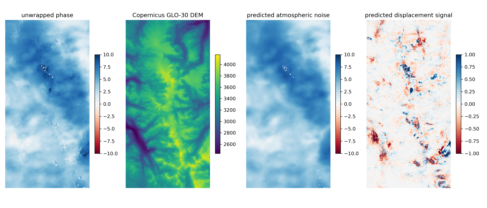

# indennt
Interferogram denoising neural network

Atmospheric noise frequently obscures real displacement signals in InSAR interferograms. This convolutional neural network has been trained to remove atmospheric noise from interferograms over mountainous environments, preserving small, defined displacement signals associated with landslides, rock glaciers, and other slope processes. It can be easily applied to correct your own interferograms. 

For more information, check out [this preprint](https://www.techrxiv.org/articles/preprint/Removing_Atmospheric_Noise_from_InSAR_Interferograms_in_Mountainous_Regions_with_a_Convolutional_Neural_Network/22626748)

## Installation
Download and install Miniconda
Set up Mamba
```
$ conda install mamba -n base -c conda-forge
```
Clone the repo and set up the environment
```
$ git clone https://github.com/gbrencher/indennt.git
$ cd ./indennt
$ mamba env create -f environment.yml
$ conda activate indennt
```
## Usage
The CNN can correct unwrapped interferograms from any source. It was trained on [HyP3](https://hyp3-docs.asf.alaska.edu/guides/insar_product_guide/) interferograms with 40 m spatial resolution. The example notebook demonstrates functions to correct HyP3 interferograms and ISCE interferograms.

```
from indennt.models import UNet, torch
from indennt.core import correct_single_igram, correct_igram_dir
import matplotlib.pyplot as plt

#load model
model = UNet()
model.load_state_dict(torch.load('weights/noisemodel1.4_174epochs'))
model.eval();

# correct a single hyp3 interferogram, return xarray ds
igram_path = '/mnt/d/indennt/hyp3_app/AT137/2020/S1BB_20200808T011058_20201007T011100_VVP060_INT40_G_ueF_70CB'
ds = correct_single_igram(igram_path,
                          model,
                          processor='hyp3',
                          igram_suffix='unw_phase.tif',
                          dem_suffix='dem.tif',
                          igram_norm=[-50, 50], # this range works well in most places
                          dem_norm=[1200, 4060], # adjust to min and max elevation in aoi
                          use_igram_range = False, 
                          use_dem_range=False # if DEM contains no outliers
                         )

# correct a single isce interferogram, return xarray ds
igram_path = '/mnt/d/indennt/isce_app/AT137/2020/20200808-20201007'
ds = correct_single_igram(igram_path,
                          model,
                          processor='isce',
                          igram_norm=[-50, 50],
                          dem_norm=[1200, 4060],
                          use_igram_range = False,
                          use_dem_range=False
                         )

# correct multiple hyp3 interferograms
hyp3_path = '/mnt/d/indennt/hyp3_app/AT137/2017' # dir containing hyp3 outputs
correct_igram_dir(hyp3_path,
                  model,
                  processor='hyp3',
                  igram_suffix='unw_phase.tif',
                  dem_suffix='dem.tif',
                  igram_norm=[-50, 50],
                  dem_norm=[1200, 4060],
                  use_igram_range = False,
                  use_dem_range=False,
                  skip_exist=True
                 )

# correct multiple isce interferograms
isce_path = '/mnt/d/indennt/isce_app/AT137/2020' # dir containing isce outputs
correct_igram_dir(isce_path,
                  model,
                  processor='isce',
                  igram_norm=[-50, 50],
                  dem_norm=[1200, 4060],
                  use_igram_range = False,
                  use_dem_range=False,
                  skip_exist=True
                 )
```


## Contact 
Please don't hesitate to reach out with questions or ideas! I'll do my best to get back to you. 
George (Quinn) Brencher: gbrench@uw.edu